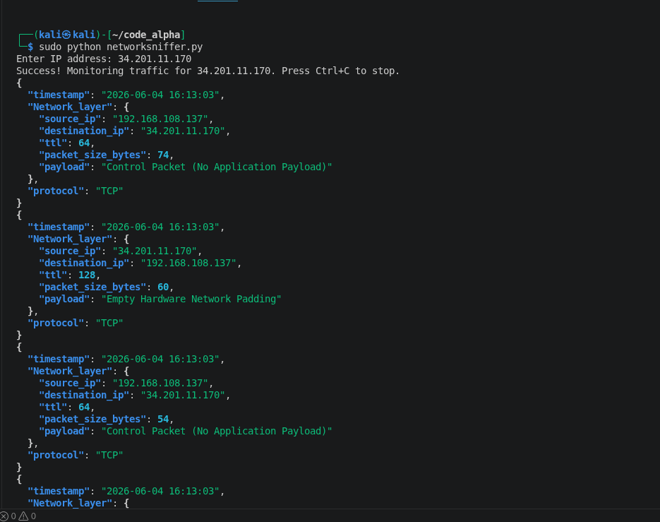
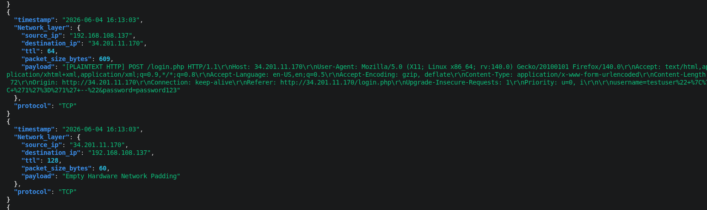
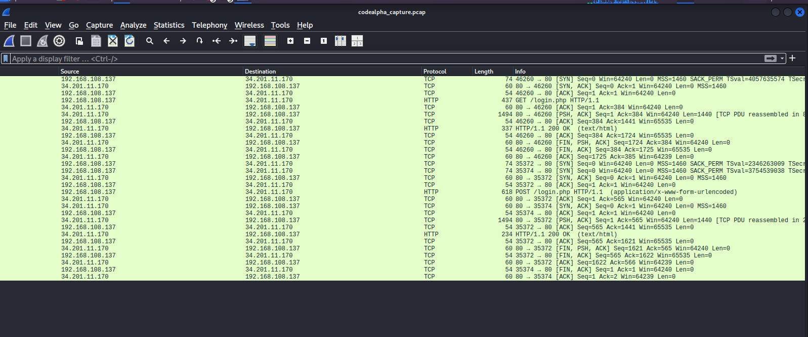
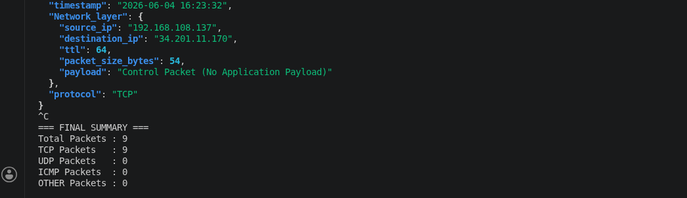

# Network Packet Sniffer


> Lightweight TCP/IP packet inspection tool — built for learning network forensics.  
> Developed as part of the **CodeAlpha Cybersecurity Internship**.

---

## Overview

A lightweight network packet inspection tool built with Python and Scapy, developed as a cybersecurity learning exercise to understand how data flows through the TCP/IP stack and how application-layer data behaves under different transport conditions.

Captures live packets, extracts metadata, analyzes payload content, and exports traffic for offline inspection in Wireshark.

---

## Objectives

| Goal | Focus Area |
|------|-----------|
| Understand packet structure | Real network traffic |
| Analyze TCP/IP layers | Layer interaction behavior |
| Compare traffic types | HTTP vs encrypted (HTTPS) |
| Practice forensics | Basic network analysis |
| External analysis | PCAP export for Wireshark |

---

## Features

- Real-time packet capture using Scapy
- IP-level filtering (target host monitoring)
- Protocol detection — TCP, UDP, ICMP
- Payload inspection (HTTP plaintext vs encrypted)
- Packet timestamping
- Packet size analysis
- Session statistics
- PCAP export for Wireshark analysis

---

## Tech Stack

| Tool | Purpose |
|------|---------|
| Python 3 | Core language |
| Scapy | Packet capture & manipulation |
| Rich | JSON terminal visualization |
| Wireshark | PCAP offline analysis |

---

## How It Works

Captures packets at the network layer using `libpcap` via Scapy.  
Each packet is parsed to extract:

- Source & Destination IP
- TTL
- Protocol type
- Payload (if accessible)

---

## Usage

**Requirements**

```bash
pip install scapy rich
```

**Run** (requires root — packet capture needs elevated privileges)

```bash
sudo python3 networksniffer.py
```

Stop capture with `CTRL+C` — stats and PCAP file are saved automatically.

**Output**
- Live JSON packet output in terminal
- `codealpha_capture.pcap` saved to current directory for Wireshark analysis

---

## Example Output

```json
{
  "timestamp": "2026-06-04 16:20:16",
  "Network_layer": {
    "source_ip": "192.168.x.x",
    "destination_ip": "34.x.x.x",
    "ttl": 64,
    "packet_size_bytes": 603,
    "payload": "[PLAINTEXT HTTP] POST /login.php ..."
  },
  "protocol": "TCP"
}
```

---

## Screenshots

### Live Packet Capture (Runtime)



> Raw packet data is successfully being intercepted and parsed at runtime.

### HTTP Traffic Analysis (Plaintext Visibility)



> Highlights the core difference between HTTP and encrypted HTTPS traffic.

### Wireshark PCAP Analysis



> Validates interoperability with industry-standard network analysis tools.

### Session Summary & Statistics



> High-level overview of network activity during the capture session.

---

## Key Learning Insights

- **HTTP traffic** is readable at the network level — application data is fully visible in plaintext captures
- **HTTPS traffic** is encrypted end-to-end — only metadata is observable, not content
- **Packet sniffing** exposes structural metadata regardless of encryption — source IPs, TTL, protocol, timing

---

## Limitations

- HTTPS traffic cannot be decrypted due to TLS encryption
- Requires elevated privileges to access raw packets
- In switched networks, only traffic associated with the host is visible
- Packet storage in memory may not scale for long captures
- IPv6 support not included in current version

---

## Output Files

| File | Description |
|------|-------------|
| `codealpha_capture.pcap` | Open in Wireshark for full traffic analysis |

---

## Disclaimer

> This project is **strictly for educational purposes** and was tested in controlled environments with explicit permission granted.  
> Unauthorized interception of network traffic is **illegal and unethical**.

---
## Author

**Ume-Habiba** · Offensive Security Practitioner & Security Researcher   

## License

[MIT](LICENSE) · CodeAlpha Cybersecurity Internship
